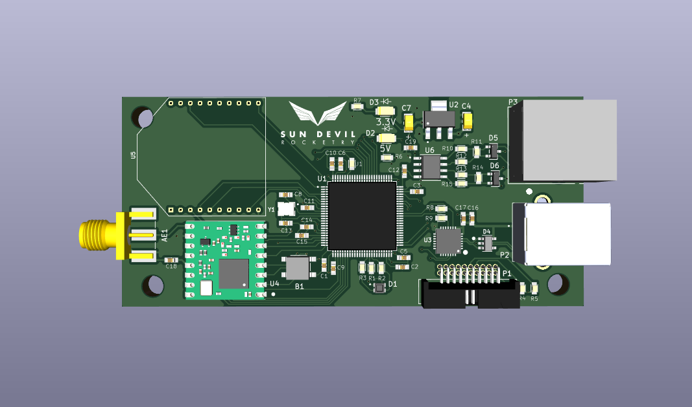
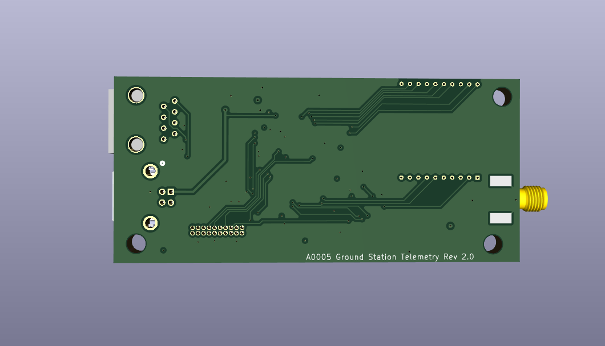

<h1>Ground Station Telemetry Unit</h1>

Current PCB Revision: 1.0

PCB Part Number: A0005

The Ground Station Telemetry Unit adds wireless connectivity to the Raspberry-Pi 
based ground station computer. The unit is equipped with a socket for an XBee module, as well as a LoRa module.

<b>Working Directory Structure:</b>

   doc: documentation
   
   src: source design files, e.g. schematic and PCB layout files

   lib: libraries for schematic symbols and footprints

   production: files needed for pcb fabrication, e.g. gerbers, profile, drill file

   sim: simulation models/files 

   cad: 3d models
  
   img: images of circuit/footprints for github display 

